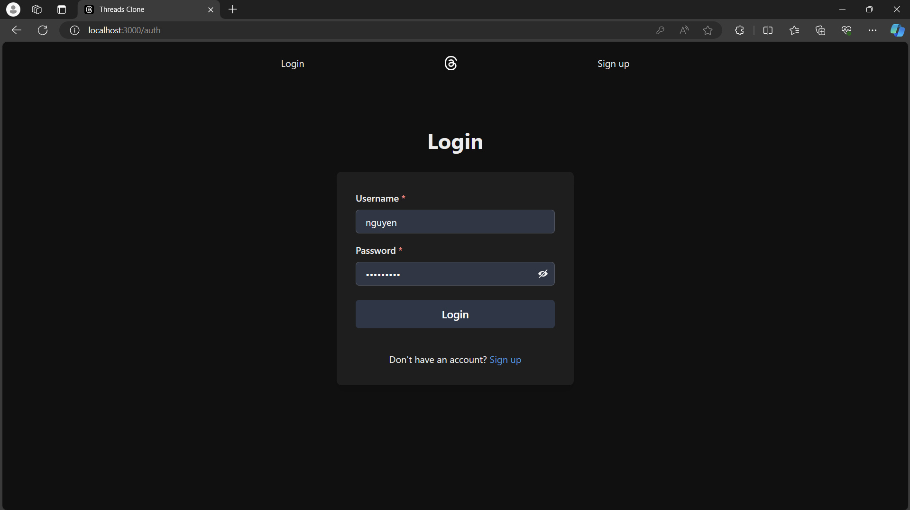
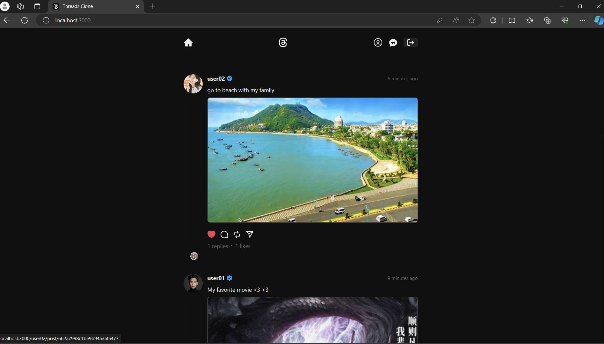
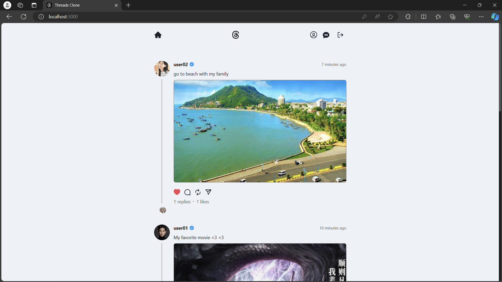
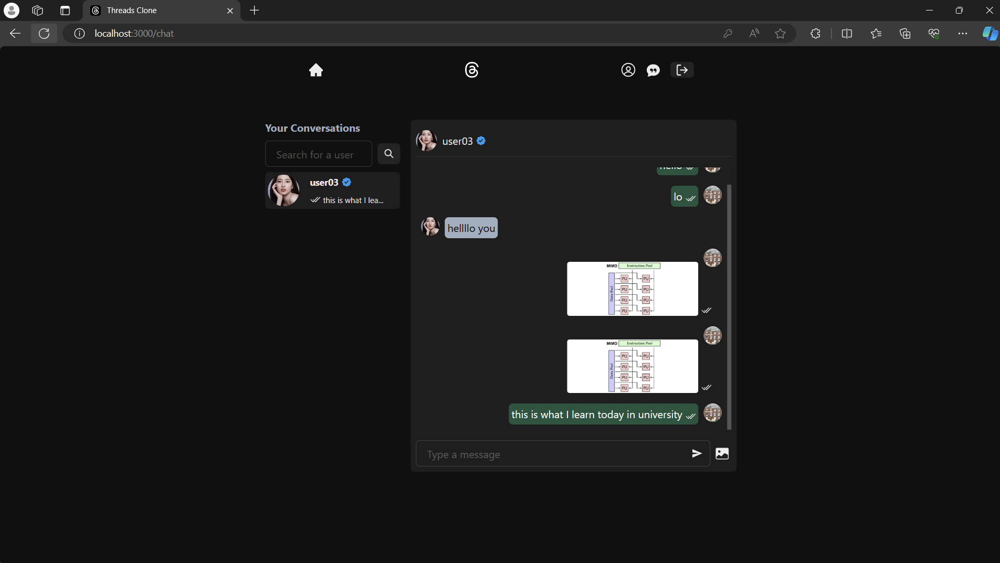

# THREAD CLONE: A SCOCIAL MEDIA WEBAPP

Feature List:

- Tech stack: MERN(MongoDB + Express.Js + ReactJs + Node) & Socket.io
- Authentication & Authorization with JWT
- Create Post
- Delete Post
- Like/Unlike Post
- Comment to a Post
- Follow/Unfollow Users
- Dark/Light Mode
- Chat App With Image Support
- Seen/Unseen Status for Messages

### Setup

- clone the repo

  ```sh
  git clone https://github.com/hongnguyen2011/threads-clone
  ```

- start front end
  ```sh
  cd frontend
  ```
  ```sh
  npm install
  ```
  ```sh
  npm start
  ```
- start backend
  ```sh
  cd backend
  ```
  ```sh
  npm run dev
  ```

### Demo picture

#### login



#### Profile


#### New feed



#### Change dark/light mode



#### Chat messaging features


